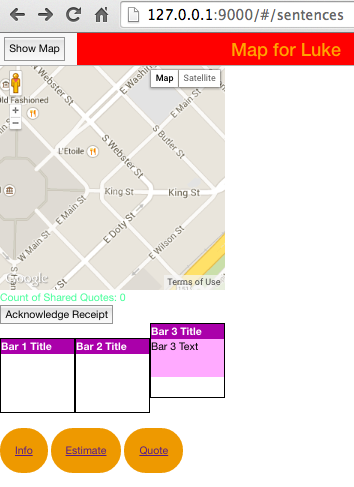
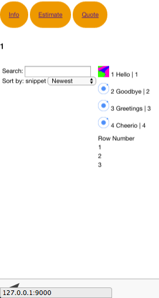
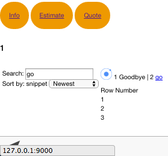
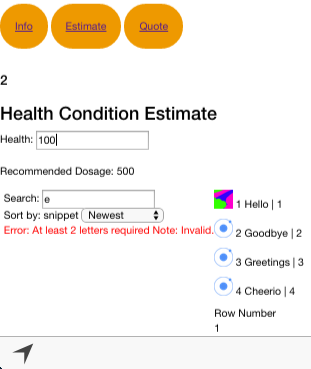
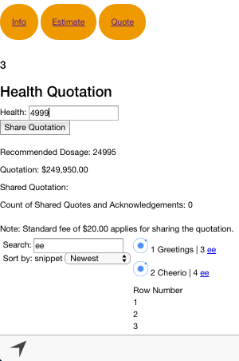
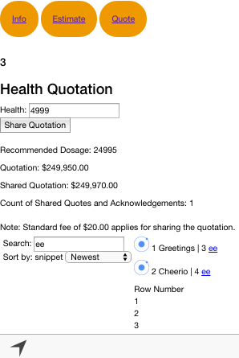
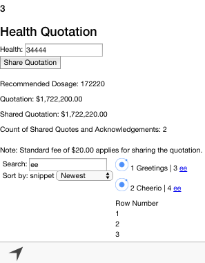
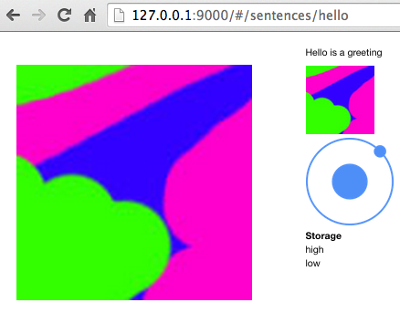
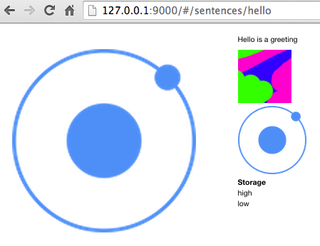

About
-------

Hybrid Yeoman-generated Ionic Mobile App built using boilerplate.

Important Note: This is a Desktop Web Browser-based App primarily focussed on experimenting with **AngularJS** capabilities (emulation on iOS Simulator using Xcode and Android Emulation with Eclipse is not currently supported). 
Refer to my other [MyHealth App](https://github.com/ltfschoen/myhealth) that was built with Yeoman using Generate Ionic boilerplate where the focus was to experiment with **Google Maps** capabilities and on maintaining **multi-platform** support for deployment with Cordova to Desktop Web Browsers, iOS Devices (iOS Simulator with Xcode), and Android Devices (Android Emulation with Eclipse).

Technologies Used
-------

* Yeoman Ionic Scaffold boilerplate
  - Grunt (Task Runner). Refer to [Gruntfile.js](Gruntfile.js)
    - Runs Cordova Builds
    - Watches (headless with PhantomJS) with LiveReload:
      - Karma unit testing errors (coded in Mocha and Chai) and detects and reports via terminal JSHint syntax errors
      - Protractor functional (E2E) errors in Chrome and Firefox (running either Selenium with Protractor in stand-alone mode or a separate Selenium Server for complex tests). Refer to [protractor.conf.js](protractor.conf.js)
    - Wiredep (automatically injects Bower components into app)
  - Bower (Package Manager). Refer to [bower.json](bower.json)
  - Cordova (Builds Web Server)
  - Compass (compiles SASS to CSS)
  - Google Maps (Cordova Geolocation Plugin)
* NPM (Node Package Manager)
* Polymer Polyfill for (see associated [commits](https://github.com/ltfschoen/yeoman_ionic/commit/270bb2e79261622688ff009ade9fb5611865bf0e))
* JSON (Datasets)
* Heroku (deployed to production with package.json start script and Procfile)
* [AngularJS]() with ngApp, ngModel (query data-bind inputs to matching data model. 'focus'), ng-minLength Directive (min length of input fields), ngRepeat (Dynamic Data using Handlebars or ngBind / ngBindTemplate, and Filter), ngController (HTTP Service to JSON Datasets), ngCloak (prevent HTML loading flicker), ngSrc Directive (image attribute binding), ngScenario/angular-scenario (KarmaJS AngularJS Test Runner with Protractor), ngRoute Module, RESTful ngResource Module Service Factory with Caching ($resource instead of $http), ngClass, ngInit, ngShow, ngClick, Custom Directives and Custom Elements ('replace' to replace Custom Elements with partial template, 'restrict' invokes a Directive on a Custom Element or an Attribute i.e. EA), $watch (observation and callback without ngChange Directive), ngTransclude (declares where original content goes and has access to parent scope), ngCookies/angular-cookies , 'template' attribute is template HTML to insert for a directive, 'require' attribute corresponds to Directive Controller of the parent element, '=' attribute data binds a property with a property in the Directive's parent scope, '@' attribute passes the attribute as string and data binds its value in enclosing scope using interpolation {{}}, '&' attribute is passed in from a function from parent scope to be called later, 'controller' attribute provides API with methods to allow communication between Custom Elements, '$emit' provides upward communications, '$broadcast' provides downward communications, Filter (Search)


Feature Progress (Basic)
-------
    
- [x] **Progress Status expander**
  1. Basic functionality with ng-show and ng-transclude
- [x] **Tab Bar Menu**
- [x] **List Sentences data**
  1. Fetches data from JSON file
  2. Sort by alphanumeric or age
  2. Thumbnails shown
- [x] **Search and Filter Sentences list**
  1. Validates minimum of 2 alphanumeric input letters
- [x] **Detailed Sentence view**
  1. Thumbnails triggering image gallery animation
- [x] **Estimate view**
  1. Calculates recommended dosage based on health condition input
- [x] **Quote view**
  1. Quotation for recommended dosage. Share quotation for additional fee.
- [ ] **Map view**
  1. Google Maps track health condition, dosage, quotation provided  :bangbang:.


Testing with Protractor (E2E)
-------

* Run with the following command in terminal to simulate tests in a Chrome Browser (all tests should pass):
  ```
  protractor protractor.conf.js
  ```

Running the App
-------

1. **Run the Web Server**: 
  ```
  grunt serve
  ```
  * Wait for it to automatically open at 127.0.0.1:9000/#/sentences or open manually at this address in your browser (Chrome recommended) http://localhost:9000/

2. **Play with App**:
  * Move mouse over "Bar 1 Title" box to show "Bar 1 Text". Move over "Bar 1 Title" again to hide.
  * Scroll down the page (by default you will be in the "Info" view no. 1 when the server loads)
  * Select "Oldest" from the "Sort by" drop-down menu to re-order the data list (shown on the right)
  * Enter "ee" in the "Search" input field to filter the data list
  * Remove "ee" from the "Search" input field to restore the data list
  * Click the "Estimate" Menu (coloured orange representing view no. 2)
  * Enter "500" in the "Health" input field and it will automatically calculate and display a "Recommended Dosage" value of "2500" (try other values if you wish)
  * Click the "Quote" Menu (coloured orange representing view no. 3)
  * Enter "1000" in the "Health" input field and it will automatically calculate and display a "Recommended Dosage" value of "5000" and a "Quotation" value of "$50,000.00" (try other values if you wish).
  * Click the "Share Quotation" button and it will automatically calculate and display a "Shared Quotation" value of "$50,020.00" (note that the quotation includes the advertised fee of $20 for sharing it) and the "Count of Shared Quotes and Acknowledgements" value will increment by 1.
  * Click the "Acknowledge Receipt" button (located higher up the page) and the "Count of Shared Quotes and Acknowledgements" value will increment by 1 again each time, also, the "Count of Shared Quotes" (coloured green) will increment by 1 each time.
  * Go to this address in Chrome: [http://127.0.0.1:9000/#/sentences/hello](http://127.0.0.1:9000/#/sentences/hello)
  * Hover over the thumbnail images (shown on the right) to swap the main image

Screenshots
-------

